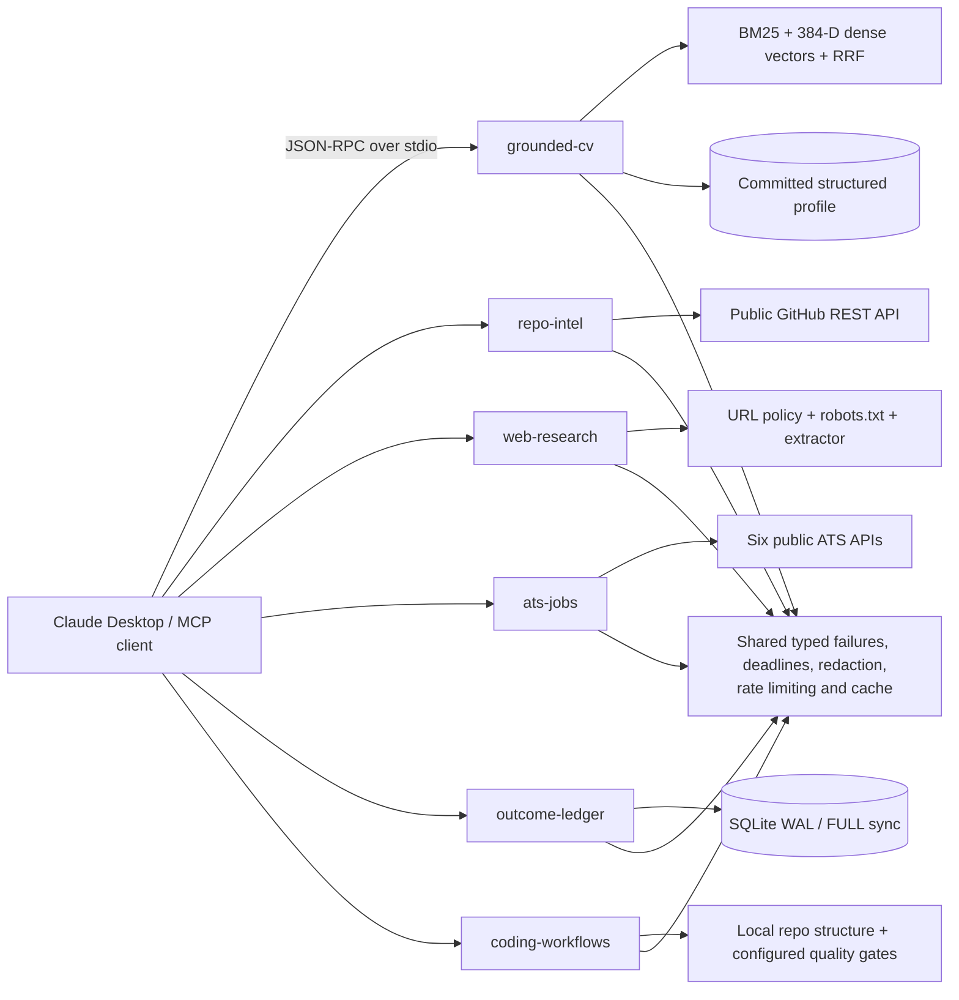

# Six production-minded MCP servers

[](https://github.com/prathamesh-git9/mcp-servers/actions/workflows/ci.yml)
[](https://www.python.org/)
[](https://github.com/modelcontextprotocol/python-sdk)

## 60-second quickstart

```bash
git clone https://github.com/prathamesh-git9/mcp-servers.git
cd mcp-servers
uv sync --all-packages --dev
uv run grounded-cv-eval
uv run pytest -q
```

That runs a real BM25 + dense + reciprocal-rank-fusion evaluation and the entire
socket-restricted test suite. Each server is directly runnable with `uv run grounded-cv`,
`uv run repo-intel`, `uv run web-research`, `uv run ats-jobs`,
`uv run outcome-ledger`, or `uv run coding-workflows`.

## `claude_desktop_config.json`

Copy this complete block. `uvx` installs the two required workspace packages from
the public repository and caches the environment locally.

```json
{
  "mcpServers": {
    "grounded-cv": {
      "command": "uvx",
      "args": [
        "--from",
        "git+https://github.com/prathamesh-git9/mcp-servers.git#subdirectory=packages/grounded-cv",
        "--with",
        "git+https://github.com/prathamesh-git9/mcp-servers.git#subdirectory=packages/common",
        "grounded-cv"
      ]
    },
    "repo-intel": {
      "command": "uvx",
      "args": [
        "--from",
        "git+https://github.com/prathamesh-git9/mcp-servers.git#subdirectory=packages/repo-intel",
        "--with",
        "git+https://github.com/prathamesh-git9/mcp-servers.git#subdirectory=packages/common",
        "repo-intel"
      ]
    },
    "web-research": {
      "command": "uvx",
      "args": [
        "--from",
        "git+https://github.com/prathamesh-git9/mcp-servers.git#subdirectory=packages/web-research",
        "--with",
        "git+https://github.com/prathamesh-git9/mcp-servers.git#subdirectory=packages/common",
        "web-research"
      ]
    },
    "ats-jobs": {
      "command": "uvx",
      "args": [
        "--from",
        "git+https://github.com/prathamesh-git9/mcp-servers.git#subdirectory=packages/ats-jobs",
        "--with",
        "git+https://github.com/prathamesh-git9/mcp-servers.git#subdirectory=packages/common",
        "ats-jobs"
      ]
    },
    "outcome-ledger": {
      "command": "uvx",
      "args": [
        "--from",
        "git+https://github.com/prathamesh-git9/mcp-servers.git#subdirectory=packages/outcome-ledger",
        "--with",
        "git+https://github.com/prathamesh-git9/mcp-servers.git#subdirectory=packages/common",
        "outcome-ledger"
      ]
    },
    "coding-workflows": {
      "command": "uvx",
      "args": [
        "--from",
        "git+https://github.com/prathamesh-git9/mcp-servers.git#subdirectory=packages/coding-workflows",
        "--with",
        "git+https://github.com/prathamesh-git9/mcp-servers.git#subdirectory=packages/common",
        "coding-workflows"
      ]
    }
  }
}
```

## `.mcp.json`

```json
{
  "mcpServers": {
    "grounded-cv": {
      "type": "stdio",
      "command": "uvx",
      "args": [
        "--from",
        "git+https://github.com/prathamesh-git9/mcp-servers.git#subdirectory=packages/grounded-cv",
        "--with",
        "git+https://github.com/prathamesh-git9/mcp-servers.git#subdirectory=packages/common",
        "grounded-cv"
      ]
    },
    "repo-intel": {
      "type": "stdio",
      "command": "uvx",
      "args": [
        "--from",
        "git+https://github.com/prathamesh-git9/mcp-servers.git#subdirectory=packages/repo-intel",
        "--with",
        "git+https://github.com/prathamesh-git9/mcp-servers.git#subdirectory=packages/common",
        "repo-intel"
      ]
    },
    "web-research": {
      "type": "stdio",
      "command": "uvx",
      "args": [
        "--from",
        "git+https://github.com/prathamesh-git9/mcp-servers.git#subdirectory=packages/web-research",
        "--with",
        "git+https://github.com/prathamesh-git9/mcp-servers.git#subdirectory=packages/common",
        "web-research"
      ]
    },
    "ats-jobs": {
      "type": "stdio",
      "command": "uvx",
      "args": [
        "--from",
        "git+https://github.com/prathamesh-git9/mcp-servers.git#subdirectory=packages/ats-jobs",
        "--with",
        "git+https://github.com/prathamesh-git9/mcp-servers.git#subdirectory=packages/common",
        "ats-jobs"
      ]
    },
    "outcome-ledger": {
      "type": "stdio",
      "command": "uvx",
      "args": [
        "--from",
        "git+https://github.com/prathamesh-git9/mcp-servers.git#subdirectory=packages/outcome-ledger",
        "--with",
        "git+https://github.com/prathamesh-git9/mcp-servers.git#subdirectory=packages/common",
        "outcome-ledger"
      ]
    },
    "coding-workflows": {
      "type": "stdio",
      "command": "uvx",
      "args": [
        "--from",
        "git+https://github.com/prathamesh-git9/mcp-servers.git#subdirectory=packages/coding-workflows",
        "--with",
        "git+https://github.com/prathamesh-git9/mcp-servers.git#subdirectory=packages/common",
        "coding-workflows"
      ]
    }
  }
}
```

## Architecture



The repository is a seven-package workspace: one small shared core and one independently
installable package for each server. Every server exposes tools, resources, and at least
one prompt over the official MCP Python SDK's stdio transport.

## What a hiring manager can verify quickly

| Server | One-line proof of work |
|---|---|
| **grounded-cv** | Structured profile resources, genuine hybrid RAG, exact-span citations, and conservative claim verification. |
| **repo-intel** | Read-only repository, language, topic, README, CI, commit, issue, and code-search intelligence through public GitHub APIs. |
| **web-research** | Search plus main-content extraction with fail-closed robots checks, SSRF protection, redirect/size limits, and per-host pacing. |
| **ats-jobs** | One typed model across public Greenhouse, Lever, Ashby, Workable, SmartRecruiters, and Recruitee boards. |
| **outcome-ledger** | Durable deterministic idempotency keys and an honest `outcome_unknown` state after a simulated process crash. |
| **coding-workflows** | Unified-diff review, dependency-aware planning, bounded repo gates, traceback-to-file triage, and conventional commit synthesis. |

The complete machine-readable catalog is pinned at [`docs/manifest.json`](docs/manifest.json),
and the detailed protocol contract is in [`docs/API.md`](docs/API.md).

## Grounded CV: demonstrable hybrid RAG

The corpus uses **atomic evidence chunking**: one independently verifiable fact per
chunk, headings retained as metadata, no chunk crossing a section boundary. This makes
every returned span independently citable and prevents a partially relevant paragraph
from laundering an unsupported claim.

Two independent rankings run for every query:

1. Okapi BM25 over normalized terms and documented synonym expansion.
2. Cosine similarity over deterministic 384-dimensional dense feature-hash vectors
   built from words and character trigrams.

Reciprocal rank fusion combines both lists with `RRF(k=60)`. The verifier then checks
claim-token coverage and numeric consistency against the retrieved spans. Supported
claims receive exact quotes; unsupported claims receive no citations.

Committed offline fixture, 10 queries, `k=5`:

| Metric | Result |
|---|---:|
| recall@5 | **1.0000** |
| MRR | **1.0000** |
| nDCG@5 | **0.9920** |

Reproduce it with `uv run grounded-cv-eval`. The fixture is committed beside the profile,
and CI executes the same harness assertions without downloading a model or calling a
network service.

## Trust and failure contract

- Every tool has generated input and structured output JSON Schemas backed by Pydantic v2.
- Every call has both an MCP-level deadline and an upstream HTTP timeout.
- Public upstream failures become typed values (`timeout`, `blocked`, `not_found`,
  `rate_limited`, `upstream_error`, `parse_error`, and others); low-level exceptions never
  cross a tool boundary.
- GitHub, web, and ATS text is explicitly marked `content_is_untrusted`; prompts instruct
  clients not to execute instructions found inside it.
- Coding diffs, tracebacks, repository text, and gate output are untrusted. Quality gates
  use shell-free argv execution, credential-reduced environments, and hard deadlines;
  configured package-manager scripts should run only in repositories the caller trusts.
- URL credentials, private networks, authenticated scraping, mutation APIs, and
  secret-shaped ledger fields are rejected. Optional `GITHUB_TOKEN` improves GitHub rate
  limits but is never returned or logged.
- Tests run with outbound sockets disabled except loopback, require no keys, and use
  protocol clients plus committed provider fixtures.

## Development

```bash
uv sync --all-packages --dev
uv run ruff check .
uv run ruff format --check .
uv run pytest
```

CI runs those three gates on Python 3.11, 3.12, and 3.13. Licensed under MIT.
